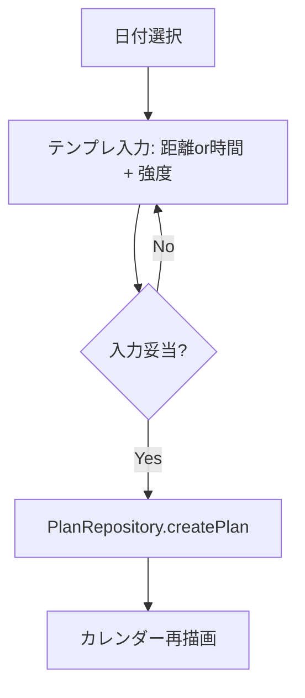
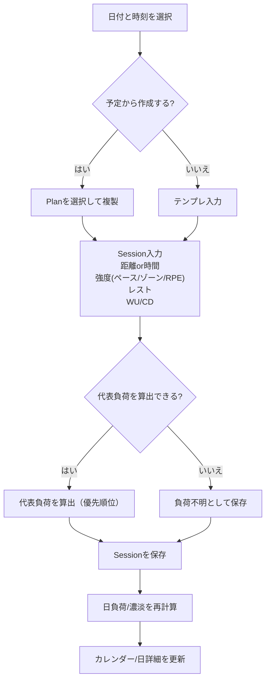
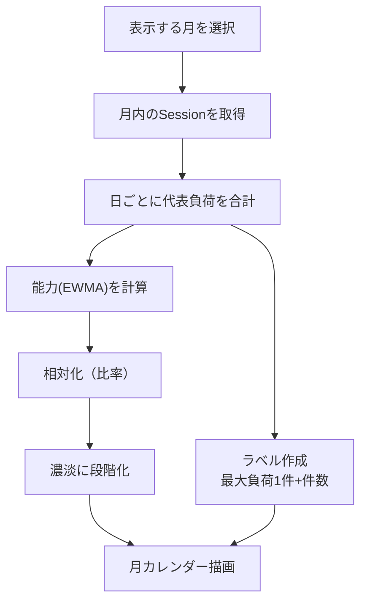

# ソフトウェア詳細設計（暫定）

本書はシステム設計の内部工程である「ソフトウェア詳細設計」を扱う。方式設計は `SOFTWARE_ARCHITECTURE.md`、要件は `SOFTWARE_REQUIREMENTS.md` を参照。

## 目的（この工程でやること）
- ソフトウェア方式設計で定めた構造を「コーディング可能な単位」まで分割する。
- 主要な動作ロジックを定義し、フローチャート（処理手順）として残す。

## プログラム単位（コーディング単位）の分割
### ドメイン/サービス（純粋ロジック）
- `LoadCalculator`
  - `computePaceLoad(session)`（rTSS風）
  - `computeSrpeLoad(session)`（sRPE）
  - `computeZoneLoad(session)`（暫定）
  - `computeSessionRepresentativeLoad(session)`（優先順位で代表負荷を選択）
- `CapacityEstimator`
  - `computeEwma(dayLoads, tauDays=42)`（能力推定）
  - `computeLoadRatio(dayLoad, capacity)`（相対化）
- `HeatmapScaler`
  - `bucketize(ratio)`（比率→濃淡段階への変換。閾値は設定で調整可能に）

### リポジトリ（DBアクセス）
- `PlanRepository`
  - `createPlan(...)`, `updatePlan(...)`, `deletePlan(id)`
  - `listPlansByDate(date)`
- `SessionRepository`
  - `createSession(...)`, `updateSession(...)`, `deleteSession(id)`
  - `listSessionsByDate(date)`（dateTimeから日付で抽出）
- `PersonalBestRepository`
  - `upsertPersonalBest(...)`, `listPersonalBests()`
- `ExportRepository`
  - `exportJson(...)`（対象: Session/Plan/PB/最低限設定）
  - `importJson(...)`（将来。MVPは実装順を後回しでもよい）

### ユースケース（UIから呼ぶ処理の塊）
- `CreatePlanUseCase`
- `RecordSessionUseCase`（予定あり/なし両対応）
- `GetCalendarMonthUseCase`（月表示に必要な日負荷・濃淡・ラベルを生成）
- `GetDayDetailUseCase`（その日の一覧・合計・内訳）
- `ExportDataUseCase`

## DB設計（drift / SQLite）
### テーブル（案）
- `personal_bests`
  - `id`（PK, UUID TEXT）
  - `event`（enum）
  - `time_ms`（int）
  - `date`（date, nullable）
  - `note`（text, nullable）
- `plans`
  - `id`（PK, UUID TEXT）
  - `date`（date）
  - `template_text`（text）
  - `note`（text, nullable）
- `sessions`
  - `id`（PK, UUID TEXT）
  - `date_time`（datetime; driftは内部的にUnix msで保存する想定）
  - `plan_id`（FK, plans.id, nullable）
  - `template_text`（text）
  - `distance_main_m`（int, nullable）
  - `duration_main_sec`（int, nullable）
  - `pace_sec_per_km`（int, nullable）
  - `zone`（enum, nullable）
  - `rpe_value`（int, nullable）
  - `rest_type`（enum, nullable）
  - `rest_duration_sec`（int, nullable）
  - `rest_distance_m`（int, nullable）
  - `wu_distance_m`（int, nullable）
  - `wu_duration_sec`（int, nullable）
  - `cd_distance_m`（int, nullable）
  - `cd_duration_sec`（int, nullable）
  - `status`（enum）
  - `note`（text, nullable）
  - `rep_load`（int, nullable）※代表負荷のキャッシュ（MVPでは後回しでも可）

### 制約（案）
- `sessions` は `distance_main_m` と `duration_main_sec` のどちらか（または両方）を許容するが、MVPの入力導線では「距離または時間」の片方を基本とする。
- `sessions` は `distance_main_m` と `duration_main_sec` の少なくとも片方が入力されることを推奨する（DBレベルでCHECKするかは実装時に判断）。
- `rest_type` が `jog` の場合のみ `rest_distance_m` を任意入力として表示する（値はnullable）。

### インデックス（案）
- `sessions(date_time)`（月表示/日集計の高速化）
- `sessions(plan_id)`（テンプレ比較/予定→実績の追跡）

## 列挙（enum）定義（内部表現）
### 種目（PB）
- `PbEvent`: `m800` / `m1500` / `m3000` / `m3000sc` / `m5000` / `m10000` / `half` / `full`

### ゾーン
- `Zone`: `E` / `M` / `T` / `I` / `R`

### レスト種別
- `RestType`: `stop` / `jog`

### 実績ステータス（Session.status）
- `SessionStatus`: `done` / `partial` / `aborted` / `skipped`

## 「負荷不明」の扱い
- 代表負荷が算出できないSessionは保存可能とする（要件どおり）。
- 代表負荷が算出できない場合の扱い:
  - `rep_load` を `NULL` とする（キャッシュを持つ場合）
  - 画面表示は「負荷不明」（ニュートラル表示）とし、追加入力を促す

## 入力仕様（UI→内部表現）
### ペース入力（単一）
- UI入力は1フィールドで受け付ける。
  - 例: `430` → `4:30/km`
  - 例: `4:30` → `4:30/km`
- 内部表現は `pace_sec_per_km`（int）で保持する。

### RPE（絵文字スライド）
- 数値入力は要求しない。
- 内部表現は `rpe_value`（0-10想定）で保持する。
- 絵文字/ラベルと `rpe_value` の対応は運用しながら調整可能にする（設定化は将来）。

### レスト
- `rest_duration_sec` は基本入力（クイックボタン＋微調整）。
- `rest_type` は `stop` / `jog`。
- `jog` の場合のみ `rest_distance_m` を任意入力（例: 200m）。

### WU/CD
- UI入力欄は用意するが、MVPでは負荷計算や統計の必須入力にしない。

## 負荷計算（代表負荷）
代表負荷の優先順位は `SOFTWARE_REQUIREMENTS.md` の決定に従う。

### セッション代表負荷（例: 実装用の関数分割）
- `computePaceLoad(session)`（rTSS風）
- `computeSrpeLoad(session)`（sRPE）
- `computeZoneLoad(session)`（暫定）
- `computeSessionRepresentativeLoad(session)`（優先順位で選択）

### 日単位代表負荷
- `computeDayLoad(date)` = `sum(computeSessionRepresentativeLoad(session in day))`
- カレンダー表示は「最大負荷の1件」＋「件数バッジ」、濃淡は日合計を使用（案A）。

### 濃淡（相対化）
- 能力推定（例）: `capacity[d] = ewma(day_load, tau=42d)`
- 相対値: `ratio = day_load / max(capacity, epsilon)`
- 段階化（例）: 閾値は運用で調整（固定/分位のどちらも検討余地）

## フローチャート（処理手順）
以下はMVPで必須となる処理の流れ。実装時はユースケース単位で責務を分ける。

### 予定作成（Plan）


### 実績入力（Session）: 予定あり/なし共通


### カレンダー月表示（濃淡 + ラベル）


## エクスポート（設計方針）
- DBスキーマバージョンを持ち、JSONに `schema_version` を含める。
- MVPは「読み出し（エクスポート）」から着手できるようにする。

### JSONスキーマ（案）
```json
{
  "schema_version": 1,
  "exported_at": "2026-01-27T00:00:00Z",
  "plans": [],
  "sessions": [],
  "personal_bests": [],
  "settings": {}
}
```

## 完了条件チェックリスト
- [x] テーブル/カラム/型が実装可能な粒度で定義されている
- [x] 主要制約（nullable条件、入力条件）が明記されている
- [x] インデックス方針が記載されている
- [x] 主要入力（ペース/RPE/レスト/WUCD）の内部表現が確定している
- [x] 代表負荷/日負荷/濃淡の計算が関数単位で分解されている
- [x] コーディング単位（クラス/関数/ユースケース）が分割されている
- [x] 主要フロー（予定作成/実績入力/カレンダー表示）のフローチャートがある
